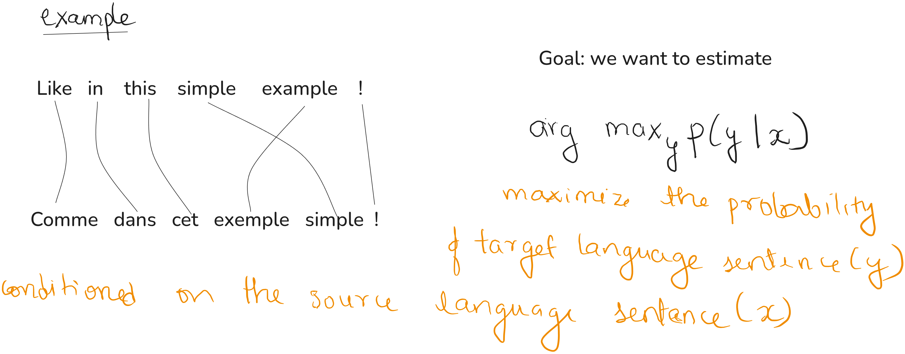
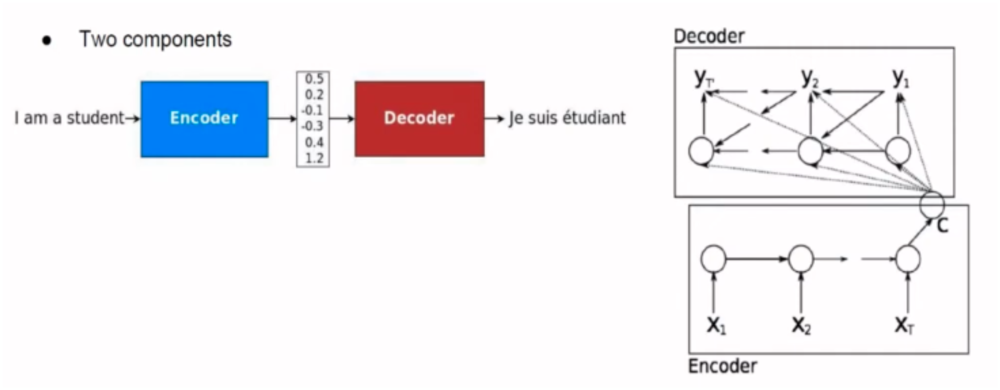

---
# ─────────────────────────────────────────────────────────────────
# HOW TO USE THIS TEMPLATE
# 1. Copy this whole "example-post" folder into:
#      src/content/<category>/<your-post-slug>/
#    <category>   = any top-level folder name under src/content
#                   (e.g. papers, til, notes) — new names just work,
#                   there is nothing to register anywhere else.
#    <your-slug>  = becomes the URL: /<category>/<your-slug>/
# 2. Rename the folder to your slug (lowercase-kebab-case).
# 3. Fill in the frontmatter fields below.
# 4. Delete this comment block before publishing (optional, but tidy).
# See also: AddABlog.md in the repo root for the full walkthrough.
# ─────────────────────────────────────────────────────────────────

title: "Neural Machine Translation by jointly learning to Align and Translate"
description: "How Bahdanau et al. (2014) replaced the fixed-length context vector with soft attention, the paper that introduced the attention mechanism."
date: 2026-08-17
# updated: 2026-08-15                # optional — uncomment if you revise later
tags: ["paper-review", "orginal attention","Bahdanau Attention"]
draft: true                          # keep true while writing; drafts are hidden from the production build
# cover: ./assets/cover.png          # optional social/listing image — only uncomment once the file exists
# coverAlt: "Description of the cover image"
---
>How Bahdanau et al. (2014) replaced the fixed-length context vector with soft attention,
> the paper that introduced the attention mechanism.

<!--
  IMAGES: put files in ./assets/ next to this index.md, and reference them
  with a relative path, e.g.:

    

  Astro optimizes them automatically at build time — no import needed.
  IMPORTANT: a broken image path fails the whole site build (even for a
  draft post), so only add an image reference once the file actually
  exists in ./assets/.
-->

## Introduction

This paper is mainly about attention, this is the first paper that applies Attention to the Neural Machine Translation(NLP in general)

## Outline

1. Task definition
2. Basic RNN Encoder-Decoder and issues related to it
3. Align and Translate (attention)
4. Bidirectional RNN
5. Experiments and Results

## The Task

X is the source language where Y is the target language
Kx is the vocabulary size of source language where Kx is the the vocabulary size for target language

I want to maximized the probability of target language sentence conditioned on the source language sentence

Source input for each instance has variable length and target sentence may or may not have the same length

## RNN Encoder-decoder (baseline)

#### Components

* Basic idea is

## Wrapping up

Delete this template content and write your own. When it's ready, set
`draft: false` in the frontmatter above, then commit and push.
